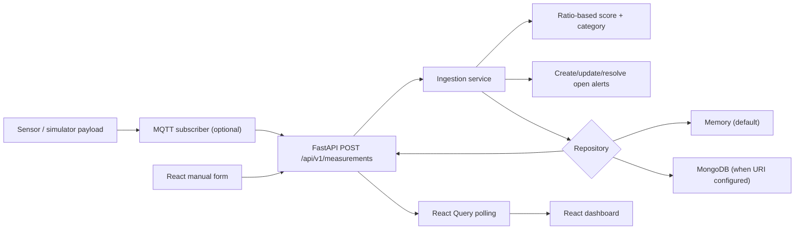

# AirWatch / Air Quality Monitoring — Technical Onboarding Review

**Review date:** 17 July 2026  
**Scope:** repository state at commit `76dcf5b` plus uncommitted workspace changes. This is a source and local-tooling review; no live MongoDB, MQTT broker, sensors, or deployed environment was available to validate.

## Executive assessment

This is an early functional prototype, not a production-integrated monitoring platform. It has a coherent Python backend and a newer React dashboard that use the same REST contract. A sensor-to-dashboard demo path exists: MQTT payload -> HTTP ingestion -> repository -> polling dashboard. However, persistence is optional and defaults to process-local memory, there is no authentication or deployment/CI setup, hardware integration is only a forwarding bridge, and automated verification is materially incomplete.

The fastest safe path forward is to first stabilise the development environment and tests, choose the authoritative dashboard (React versus the legacy Streamlit dashboard), then harden ingestion/persistence before expanding ML or UI features.

## Repository state

- Git HEAD: `76dcf5b` (`update to alert center`); history has only three commits, beginning with `e697264`.
- Uncommitted changes exist in `README.md`, `frontend/package-lock.json`, and `frontend/src/components/dashboard/KPICards.tsx`; `requirements.txt` is untracked. Treat these as another developer's work until ownership is confirmed.
- The repository ignores logs, local virtual environments, artifacts, and `frontend/node_modules`; those are present locally but are not deliverable project state.
- No tracked `tests/` directory, CI workflow, Dockerfile, Compose file, migration system, or deployment manifests exist.

## Structure and stack

| Area | Location | Observed technology / role |
|---|---|---|
| Backend API | `src/air_quality_monitoring/api/app.py` | Python, FastAPI, Uvicorn, Pydantic models |
| Domain/services | `domain/`, `services/` | AQI-like scoring, alert lifecycle, ingestion, simulator, classifier |
| Persistence | `storage/` | Repository interface; in-memory default; optional PyMongo implementation |
| Device bridge | `mqtt_subscriber.py` | Paho MQTT consumer that POSTs JSON to the API |
| Main web UI | `frontend/` | React 18, TypeScript, Vite, Tailwind/shadcn/Radix, React Query, Recharts |
| Legacy/parallel UI | `dashboard/app.py` | Streamlit, pandas, Plotly, requests |
| ML artifact | `artifacts/aqi_classifier.joblib` | Joblib-persisted sklearn Random Forest, generated at runtime and ignored by Git |

The Python package uses a `src/` layout with `pyproject.toml`; its declared supported floor is Python 3.11. The frontend is a separately managed npm project, not a monorepo workspace.

## How the system works today

1. `POST /api/v1/measurements` accepts a validated reading. Required fields are particulate and gas values plus temperature/humidity; `voc` and `timestamp` are optional.
2. `IngestionService` applies a current UTC timestamp when absent, computes per-pollutant ratios using five embedded guideline values, and stores the maximum ratio × 100 as `computed_index`.
3. It optionally calls a locally stored sklearn artifact for a category prediction, saves the measurement, and evaluates alerts.
4. Alerts are raised for guideline exceedance, high/low humidity, high temperature, and unhealthy/hazardous overall score. An existing **open** alert for the same device/pollutant is updated; an open alert absent from the next reading's candidates is resolved.
5. The dashboard polls health, summary, measurements, and alerts every 10 seconds by default. It supports manual entries, seed data, alert acknowledgement, an API URL override, device filtering, and model training.
6. FastAPI serves `frontend/dist` only after a frontend build exists. The React dev server otherwise runs separately on port 8080.

## API surface actually implemented

| Endpoint | State / purpose |
|---|---|
| `GET /health` | Reports `ok` and repository class name |
| `POST /api/v1/measurements` | Ingests one reading and returns computed record |
| `GET /api/v1/measurements` | Descending list; supports `limit`, `offset`, `device_id` |
| `GET /api/v1/measurements/latest` | Latest record, optionally by device |
| `GET /api/v1/summary` | Latest record, open alerts, model status, aggregates over up to 240 rows |
| `GET /api/v1/alerts` | Alerts filtered by status/device, limited to 500 |
| `POST /api/v1/alerts/{id}/acknowledge` | Changes alert to acknowledged; no identity/auth check |
| `POST /api/v1/simulator/seed` | Inserts generated readings; suitable only for demo/development |
| `POST /api/v1/models/train` | Trains and writes a local model artifact synchronously |

## Integration maturity

| Integration | Level | Evidence and limitation |
|---|---|---|
| React ↔ FastAPI | Partial / working by design | Typed client matches implemented endpoints; uses HTTP polling, not push. Build was not reproducible locally (see validation). |
| FastAPI ↔ storage | Partial | Repository abstraction and Mongo implementation exist. Empty `MONGODB_URI` means all data disappears when the API process restarts. |
| Sensor ↔ backend | Stub/prototype | MQTT script subscribes and forwards parsed JSON. No schema/version/topic policy, retry queue, dead-lettering, deduplication, device provisioning, TLS/auth configuration, or observability. |
| API ↔ legacy Streamlit UI | Functional but duplicate | Streamlit directly calls the same API. The bootstrap script still advertises it, while README foregrounds React. This is an unresolved product decision. |
| ML | Demonstration only | Training has no held-out evaluation and fills small datasets with synthetic, rule-labelled observations; output largely learns the same deterministic rule used as its label. |
| Production operations | Not integrated | No auth, user/role model, secrets management policy, health/readiness distinction, structured logs, metrics, containers, CI, or deployment. |

## Reproducible validation performed

| Check | Result | Details |
|---|---|---|
| Backend unittest command from README | Blocked | No `tests` directory is tracked. The discovered local virtualenv launcher points to a missing `C:\\Users\\HP\\...\\Python314\\python.exe`; it cannot run Python. |
| `npm run lint` | Fails | Three ESLint errors: empty interfaces in `components/ui/command.tsx` and `textarea.tsx`, and `require()` in `tailwind.config.ts`. Nine React fast-refresh warnings. |
| `npm run test` | Fails before tests start | esbuild cannot read a parent directory and consequently cannot resolve `vitest.config.ts`. It is unclear whether this is a sandbox/OneDrive path issue or project tooling issue; rerun in a normal local shell before diagnosing as source failure. |
| `npm run build` | Fails before compilation | Same esbuild directory-access/config-resolution failure. This prevents verifying the static build in the reviewed environment. |

The frontend does have one placeholder `example.test.ts`, but its test command could not reach it. The README statement that core AQI/alert tests are included is incorrect for the tracked repository.

## Material gaps and risks

### P0 — establish a trustworthy runnable baseline

- Repair/recreate the local virtual environment using an installed supported Python version. Do not commit virtualenvs.
- Resolve the frontend's esbuild path-access failure outside this restricted runner, then make `npm ci`, lint, test, and build clean from a fresh checkout.
- Add a small backend test suite before changing scoring or alert behavior. At minimum cover validation, score/category boundaries, open/acknowledge/resolve transitions, pagination, and Mongo mapping.
- Decide which dashboard is supported. Maintaining React and Streamlit simultaneously duplicates product behavior, docs, and release risk. The React app is the more complete current UI; either deprecate Streamlit or explicitly position it as an admin/analyst interface.

### P1 — data correctness and service reliability

- `computed_index` is not a standards-based AQI calculation: it is `max(reading / embedded guideline) * 100` with four broad bands. It should not be presented as a WHO AQI without a documented, approved methodology, averaging periods, units, breakpoint tables, and calibration policy. Rename it to a risk/exceedance score until that work is done.
- Validation only checks non-negative ranges (and humidity 0–100). It does not verify unit convention, plausible upper bounds, clock skew, out-of-order readings, duplicate device messages, or sensor quality flags.
- `summary` reports averages where absent `voc` values are treated as `0`, which biases results. It also only assesses the most recent 240 rows although its `measurement_count` sounds global.
- Mongo startup constructs indexes and will fail application startup if the DB is unavailable; there is no controlled readiness/error behavior. Create composite indexes aligned with actual query/order patterns, especially device + timestamp.
- Alert lifecycle is incomplete: acknowledged alerts are excluded from future reconciliation because only `OPEN` alerts are loaded. Consequently an acknowledged alert will remain acknowledged when the condition clears, and a later reoccurrence creates a new open alert rather than updating/reopening the acknowledged record. Define the intended incident model and test it.
- The application uses global singleton services and synchronous route handlers. ML training runs inline, writes a shared local artifact, and has no concurrency protection or job state.

### P1 — security

- All API endpoints, including simulator, ML training, and alert acknowledgement, are unauthenticated. This is unsafe beyond a local demonstration.
- CORS is configured with `allow_origins=["*"]` and credentials enabled. Even though browsers restrict wildcard credentials, the policy is not a safe deployment configuration. Allow only known web origins and use a real auth/session design.
- `.env` exists locally and is ignored, which is appropriate; verify it is never committed and replace developer-local connection strings with managed secret injection for deployment.
- MQTT uses plain broker defaults and no username/password/TLS options. The HTTP bridge has no request authentication, retries/backoff, or poison-message handling.

### P2 — ML, scalability, and maintainability

- The classifier is trained on labels calculated by the same rule engine, with synthetic rows filling most small datasets. It does not establish predictive value, and it lacks train/test split, metrics, feature/version metadata, drift monitoring, approval, or rollback.
- Memory storage is thread-safe only inside one process; it provides no durability, cross-worker consistency, retention, or query scalability.
- List pagination has no total count. The frontend's `hasNextPage` heuristic can be wrong at exact page boundaries, and the table filters/searches only the current server page.
- API clients use plain `fetch`; no request cancellation, timeouts, error normalization, or schema/runtime response validation are present.
- The API `summary.stats` is a loose dictionary rather than a typed response model. This weakens contract evolution.
- Dependency management is confused: `pyproject.toml` specifies ranges while untracked `requirements.txt` is a machine-specific, editable Git URL plus many exact transitive packages. Choose a reproducible strategy (e.g. `pyproject` + lock file) and document it.

## Recommended implementation sequence

1. **Baseline:** protect current uncommitted work, recreate Python environment, resolve frontend build path, clean the three lint errors, and make fresh-checkout commands documented and executable.
2. **Tests and contract:** introduce pytest or unittest tests, API contract tests, a React component/integration test suite, and CI that runs backend tests plus `npm ci && npm run lint && npm run test && npm run build`.
3. **Product boundary:** select React as primary UI or formally support both; remove stale setup instructions accordingly. Define what “real time,” operator acknowledgement, and alert resolution mean.
4. **Data/ingestion:** finalise sensor payload schema (units, calibration, sequence/message ID, timestamp source, quality); make ingestion idempotent; persist in Mongo or a time-series store; add retention and query indexes.
5. **Security/operations:** environment-specific CORS, API/device auth, rate limits, input audit trail, broker TLS/auth, structured logging, metrics, readiness checks, Docker/Compose for local stack, and deployment configuration.
6. **Scoring/alerts:** agree a defensible air-quality methodology with domain owners, implement it as versioned code/config, and define alert state transitions including acknowledgement/recovery/reopen/escalation.
7. **ML last:** only retain ML after obtaining labelled historical data and a measurable prediction objective. Add offline evaluation and a background training/deployment workflow; otherwise show deterministic scoring transparently.

## Practical handover notes

- Start the backend with `python -m uvicorn air_quality_monitoring.api.app:app --reload --host 127.0.0.1 --port 8000` once the environment is repaired. It will use memory until `MONGODB_URI` is set.
- Start React with `npm run dev` in `frontend`; it defaults to port 8080 and maps API calls to port 8000 when running there. A `VITE_API_BASE_URL` can override the target.
- Build React before expecting FastAPI to serve `/`; the API deliberately does nothing for frontend routes without `frontend/dist`.
- The simulator is deterministic (`Random(42)`) across a service lifetime but advances its state after each seed request; it is useful for demos, not repeatable fixture generation across arbitrary operation history.
- The current README setup mentions Python 3.14 and `ensurepip`, while the broken local launcher references a different user's Python path. Prefer a supported, team-standard Python 3.11–3.13 toolchain and pin it in contributor docs/CI.

## Questions for the leads

1. Is the expected deliverable a demonstrator, a campus/local pilot, or an internet-exposed product? This determines security, persistence, and uptime scope.
2. Which UI is authoritative: React, Streamlit, or intentionally both?
3. What sensors, units, sampling/averaging periods, calibration process, and MQTT deployment are planned?
4. Is “AQI” a presentation term or a requirement to implement a named regulatory/health standard? Who owns validation of thresholds?
5. Is ML an assessed project requirement, and if so what real target is it expected to predict beyond the deterministic category already calculated?
6. Is MongoDB the intended production datastore, and what retention, tenancy, operator, and audit requirements apply?

## Bottom line

The codebase is a solid starting demonstration with a reasonable separation of backend responsibilities and an actively evolving React UI. Its main limitations are not feature absence alone: the running baseline is not currently verifiable in this environment, core test/CI discipline is missing, and the terms “real-time”, “AQI”, “ML”, and “integration” currently overstate what the implementation guarantees. Address those foundations first; doing so will make later sensor, analytics, and UI work much faster and safer.
